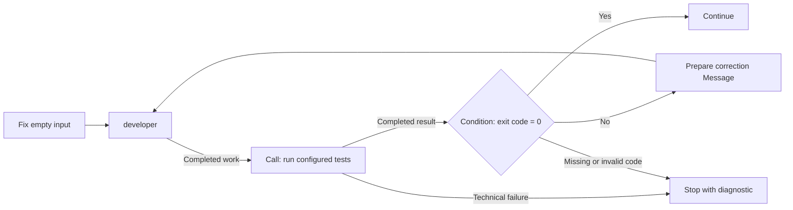
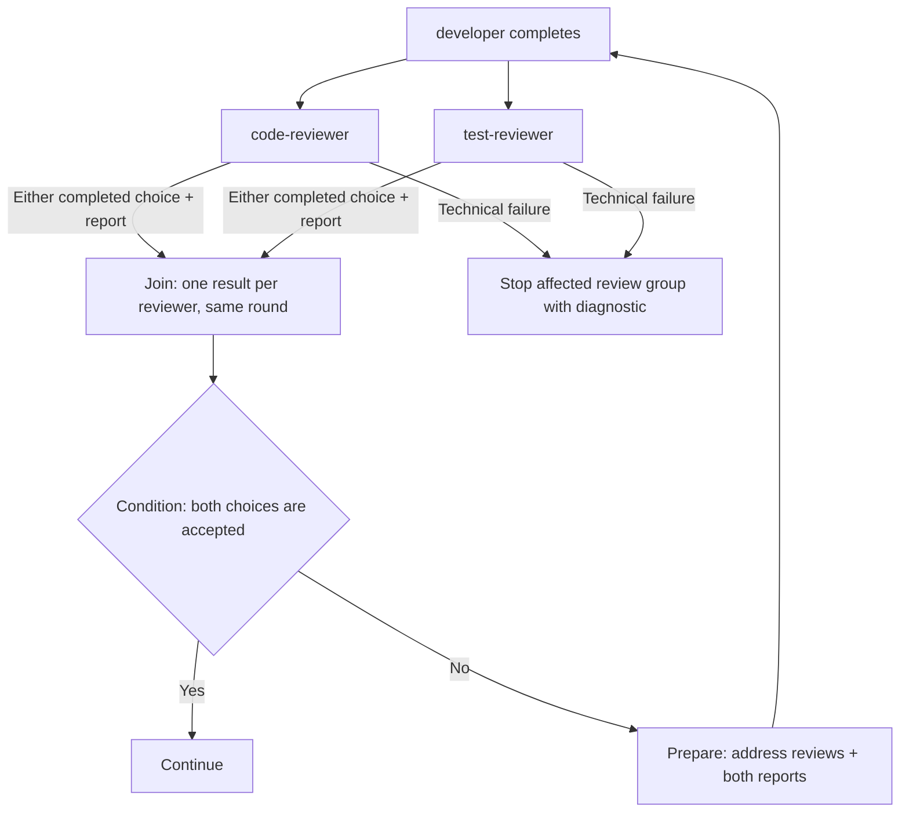

# Worked scenarios for the next AgSDL model

Status: **illustrative 0.2 preparation, not executable fixtures or an adopted
grammar.** These walkthroughs apply the accepted directions in
[0019](../../proposals/0019-agent-prompt-and-resources.md) and
[0020](../../proposals/0020-blueprint-flow-0.2.md), and exercise the proposed blocks
in [0021](../../proposals/0021-logic-block-contract-0.2.md). Those documents remain
the sources of semantics. Read the [preparation index](README.md) for their status.

Quoted requests and replies are invented examples. Tables describe authored
configuration and expected behavior, not JSON fields or a runtime protocol.
Engine and implementation selections belong to each consuming system; these
examples prescribe no provider. Error paths stop with a diagnostic unless the
example declares recovery. Nothing here demonstrates execution support.

## 1. One Agent, two requests, continuing context

An author configures one Agent named `helper` with access to a project, a
read-only file Tool and an Engine that supports the requested text exchange.
The author omits the initial prompt. Initialization therefore prepares `helper`
to wait; it does not start a task.

```mermaid
sequenceDiagram
    participant U as Requester
    participant A as helper, same Agent
    U->>A: Explain parseDate, with source and failing example
    A-->>U: I am checking empty input.
    Note over A: Read source through configured Tool
    A-->>U: Empty input reaches the parser without a guard.
    Note over A: Current work completes; Agent remains available
    U->>A: Suggest a minimal fix, without editing files.
    A-->>U: Return an error before calling the parser.
```

The first Message has distinct content roles:

| Role | Content |
| --- | --- |
| Instruction | "Explain why parseDate fails on empty input. Read the supplied source." |
| Information | A reference to the source file, resolved through the configured project access. |
| Information | Inline text showing the failing example and observed error. |

The reference is usable only if the configured integration can resolve and read
it. It does not grant access. These two information items form part of one
Message; neither requires an additional Agent or flow step.

For the first completed request, the default transferable result contains both
visible replies, in order: "I am checking empty input." and "Empty input reaches
the parser without a guard." The Tool invocation and its raw result are excluded.
The integration associates those replies with completion of this request; the
progress sentence alone does not complete it. Exact text assembly remains open.

The second request uses the same Agent and its continuing context. Its result
contains only the new visible response. Earlier replies remain in the Agent's
context but are not implicitly retransmitted as the second result. This scenario
delivers the second request after the first completes, so it needs no steering
rule. Fresh context would require a different Agent.

A basic conversation needs an Agent, Messages and
configured access. None of the four logic blocks is mandatory.

## 2. A developer and deterministic tests

The goal is to fix `parseDate` until its configured test suite passes. The author
initializes `developer` with instructions to make minimal changes and summarize
them, an Engine, editing Tools and a writable workspace. Its first Message asks
it to fix empty input. The same Agent receives later correction requests.



The test Call uses an explicitly selected implementation. Its contract accepts
the configured workspace and suite, and returns an integer exit code and a text
report after the test process finishes. Code zero means the suite passed; other
returned codes mean it did not pass under this example's contract. Failure to
start the process is a technical failure with no normal suite result.

The workspace is shared by configuration, not embedded in the developer's reply.
For this example, the developer waits while tests run and no other writer changes
the files. This is a scenario assumption, not an AgSDL workspace lock or snapshot
guarantee. A consuming system must arrange the access it declares.

| Step | Explicit input and behavior | Result used next |
| --- | --- | --- |
| Developer | Current request plus existing context and workspace access. | Completed visible response; its completion starts tests. |
| Test Call | Configured workspace and suite. It does not parse the developer's reply to find a command. | Exit code and test report for this invocation. |
| Condition | The current Call's exit code. Compare it with zero. | Select the corresponding continuation. |
| Prepare on failure | The current Call's report, explicitly bound as information, plus an authored instruction. | One Message requesting correction, containing that report. |

The Condition selects the path; it does not replace the report with a Boolean.
Prepare's reference to the current Call result makes the report available on
that path. The [bounded c1 contract](../../experimental/agent-flow-0.2/README.md#flow-and-data)
proposes selectors into the current input; their syntax is not yet adopted.

An illustrative traversal:

| Visit | Observed result | Next action |
| --- | --- | --- |
| First development | "I added an empty-input check." | Run the suite. |
| First test Call | Code 1; report: "Whitespace-only input still fails." | Send one correction Message to `developer`. |
| Correction | Instruction: "Fix the failure and rerun through this flow." Information: the first test report. | Developer edits with its existing context. |
| Second development | "Whitespace-only input now follows the same check." | Run the suite again. |
| Second test Call | Code 0; report: "All configured tests passed." | Continue. |

The proposed Prepare preserves the report as information, including any text
inside it that resembles instructions. It does not elevate that text into the
authored request. The Call result is available because this graph declares it;
raw Tool output is not added to Agent result transfer by default.

A missing or wrongly typed exit code follows the proposed Condition error rule.
It does not count as a failed assertion or trigger a guessed model verdict.
A launch failure stops this example with a diagnostic. Neither failure silently
retries the Call. The loop has no authored iteration limit; an author can add one
under 0020. The bounded c1 contract now proposes per-step visit counting and
limit handling; these rules remain unadopted.

One persistent Agent plus Call, Condition and Prepare
can express the loop. An Agent judgment is unnecessary for the exit-code rule.

## 3. Two reviews, one correction request

The author configures `developer`, `code-reviewer` and `test-reviewer` before
work starts. The reviewers have read-only project access. Their instructions
respectively ask for code review and test-coverage review, with a report and one
final choice: `accepted` or `changes_needed`. These names and their meanings
belong to this blueprint.

Each review integration explicitly maps its completed decision to those choices.
For this walkthrough, assume the integration supplies a separately identified
final choice and visible report for the same work. This specifies the needed
boundary without requiring a Tool call, structured model response or special
text syntax from every Engine. A concrete integration must still implement and
demonstrate its chosen mapping before this graph can run.



Both reviewer steps start from the same developer completion. Each receives the
developer's default visible result as information in its current Message, with its review task
provided by its own instructions. The reviewers inspect the workspace through
their configured access. In this example, the workspace remains unchanged until
both reviews complete, and no unrelated requests enter these Agents.

Both choices from each reviewer connect to the Join. The diagram combines those
two connections for readability. The Join expects **one completed result from
each reviewer for this round**, not four results for four possible connections.
The result includes the visible report and an explicit binding of the selected
choice as control data. It does not insert a hidden decision into the report.
If the reviewer also states its choice in visible text, that text stays intact.

| Round | Code review | Test review | Join and continuation |
| --- | --- | --- | --- |
| First | `accepted`; "The guard is clear." | `changes_needed`; "Add whitespace-only coverage." | Wait for both, then send one correction Message with both reports. |
| Second | `accepted`; "The revised code is clear." | `accepted`; "The requested case is covered." | Group both current results, then continue. |

Prepare uses the authored instruction "Address the requested changes in these
reviews and explain your corrections." It adds both reports as information with
their origins preserved. Developer receives one Message and retains its context.
Both review Agents also retain theirs when the second round begins.

The first reviewer finishing does not start correction by itself. A delayed
duplicate from the first round cannot fill the second round's Join. The system
must associate results with the relevant visits to the graph; `first` and
`second` here are explanatory labels, not proposed serialized identifiers.

A technical failure, missing report or invalid required choice prevents normal
group completion. This example reports the problem rather than fabricating an
unfavorable review or dropping a required reviewer. A diagnostic does not prove
that a still-running sibling has stopped. Restart or recovery would need an
explicit policy. The example uses all-required Join, so it does not depend on
first-satisfactory tie or cancellation rules.

Without Join, direct connections from both reviewers to developer would deliver
two separate Messages, queued by default. That is a different authored behavior.
Neither a favorable review nor the label `accepted` grants permission for a
separately protected action.

Parallel connections and an explicit Join are enough.
Grouping, Agent judgment and deterministic comparison remain separate operations.

## A custom implementation with the same visible contract

The test Call in scenario 2 can use a custom implementation. For illustration,
call its contract `example/test-suite`, version `1`. This is a fictional local
contract, not a registered standard or executable repository artifact.

| Contract part | Authored meaning |
| --- | --- |
| Inputs and parameters | Workspace access and the selected suite. |
| Results | Integer exit code and text report, with the meanings used in scenario 2. |
| Completion and failure | Test process finished versus process could not start or implementation could not produce the required result. |
| Effects and access | Read the project and run the configured tests. The implementation declares required write access, temporary artifacts or other effects of that suite. |
| Selection and support | Select the implementation before starting. Its compatibility, availability and permissions require evidence from the consumer. |

One implementation can run a local suite; another can invoke an internal testing
service if it can satisfy the same contract, including access to the intended
project state. That second implementation must declare its service access and
data-transfer requirements. Equal field names alone do not prove compatibility.

The graph still reads the declared exit code and report. No extra Agent or
mandatory new standard block is needed. If the implementation is unavailable,
the affected path is unsupported rather than silently skipped. A static reader
does not fetch or execute it to determine support. Any protected call retains its
approval requirement through this implementation.

For visual reuse, the proposed local composition can group this Call with the
Condition from scenario 2. It exposes the pass, correction and failure paths,
and explicitly binds the report for the correction path. Expanding it reveals
the same graph. It neither creates an Agent nor resets `developer`. A custom
scheduler or Agent-lifetime rule would need a separate semantic extension.

## Candidate coverage and remaining work

The [bounded candidate](../../experimental/agent-flow-0.2/README.md) supplies
serialized examples and static checks for basic conversations, deterministic
test loops, direct fork-and-join, output correction and first-satisfactory
selection. These walkthroughs remain illustrations, not execution traces.

The [preparation index](README.md#before-a-02-release) tracks the remaining
contract and adoption work. In particular, queue/steering overlap, exact text
assembly, composition and the protected-action binding are not settled by these
sequential-request scenarios. Repository checks on this document verify its
maintenance, not the runtime behavior described in its tables.
