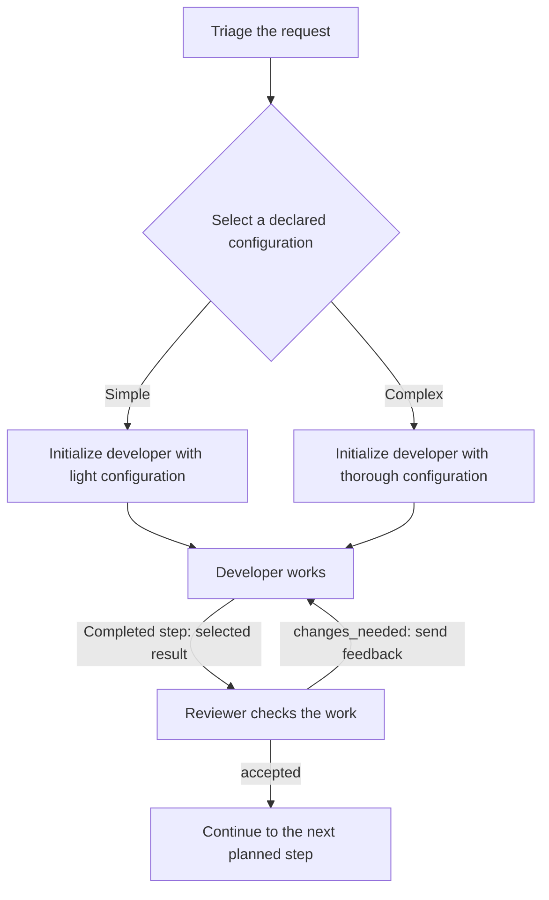

# Proposal 0020: message flow for persistent Agents

Status: **0.2 design directions accepted under
[Decision 0012](../docs/decisions/0012-blueprint-flow-directions.md), refined by
[Decision 0013](../docs/decisions/0013-named-outcomes.md) for named outcomes;
concrete serialization and validation rules remain proposed.**
This extends the [Agent and Message model](0019-agent-prompt-and-resources.md).
It does not change the implemented 0017 candidate or the published specification.

## Problem and scope

Persistent Agents need a way to receive successive work, pass results and
cooperate. A graph limited to one acyclic sequence cannot describe a correction
loop, parallel reviews or a choice of configuration made by an earlier step.

Describe those choices in the system blueprint. Here, **blueprint** means the
authored system description, including its configuration and optional flow. It
is not an additional entity beside the system. A **step** is a unit of work in
that flow; completing it does not end an Agent's lifetime. Message content and
Agent continuity keep their definitions in 0019.

Flow remains optional. A single Agent exchanging Messages needs no graph. When
flow is declared, it describes what a consuming implementation should do. This
repository provides static readers, not an execution engine or a new transport.

## Accepted flow directions

### Completion and result transfer

When an Agent finishes a step, the flow proceeds to the planned successor or
successors. An intermediate Message is not sufficient evidence of completion.
The Agent remains available with its context for later steps.

Transferred content is configurable. By default, transfer the Agent's last
Message belonging to the completed step, including its content items. An
explicit selection can instead transfer specified results, content or file
references. Selecting a file reference does not grant access to its target.
Previous conversation history and internal context are not transferred by
implication. A previous step's reply cannot stand in for a missing current
result. Exact selection syntax and the treatment of a step without a Message
remain candidate work.

Completion and a satisfactory result are different. A review that finishes with
"changes needed" can take the normal correction path. Interface constraints
still apply where declared; a malformed required result is not a valid success.

### Named outcomes independent of the Engine

A **named outcome** is an authored choice of continuation for a step. A review
can declare `accepted` and `changes_needed`, each connected to its intended
continuation. Names are local to that step and chosen by the blueprint author;
AgSDL has no universal verdict vocabulary. An outcome is a flow choice, not
another Agent type, an Agent lifecycle state or a required decision entity.

An ordinary sequence needs no named outcome: completion advances to its planned
continuation. Explicit parallel work still starts its declared branches without
selecting one. Multiple outgoing connections alone do not imply a choice.
At a declared choice, the Agent selects exactly one of the available outcomes
for that occurrence of the step. The same Agent can select a different outcome
on a later visit. A choice does not redefine the available continuations.

The Agent's instructions explain when to choose each outcome. The blueprint
records the available outcomes and their connections so software can follow
the choice without interpreting the report's prose. Graph illustrations may
label connections directly; this does not require an extra decision node or
prescribe an editor's representation.

The choice is separate from the content transferred to the next step. A report
can remain free text, contain several media items or refer to documents. Named
outcomes do not impose a schema on that whole result. Explicit Interface
constraints and the result-transfer rule above still apply.

#### Communicating the choice

The selected Engine integration supplies a configured mechanism that presents
the available choices to the Agent and recognizes its selection. That mechanism
maps to the same named outcomes regardless of the harness. Examples include a
structured field, a Tool call, an agreed text position or a human interface.
These are integration possibilities, not a closed list or claims that particular
products support AgSDL. Engine includes the harness and its integration as in
0019; this adds no separate adapter entity or mandatory Tool or MCP dependency.

The integration contract identifies where the choice comes from, how it maps
to a declared name and how it belongs to the current occurrence of the step.
It also identifies the produced Message content used by the transfer rule, so
an administrative Tool acknowledgement cannot silently replace the Agent's
report. Changing the mechanism preserves those meanings; it follows the existing
stop, edit and start rule for configuration changes.

A text-only integration can ask for an exact marker at an agreed position in
the final reply and check it there. It cannot substitute a guessed meaning from
arbitrary prose, quoted material or a consulted resource. The marker's spelling
and extraction rules belong to the integration contract; the illustration below
is not a standard wire format. Model compliance with that convention requires
checking, even though no native structured-output support is needed.

#### Completion and invalid choices

Continue through the selected outcome only after the step completes, its choice
is valid and any declared required results are valid. Recording a choice through
a Tool during work does not itself complete the step or start its continuation.
A failed or interrupted step follows recovery even if it recorded a choice
earlier. An intermediate Message is not a final decision.

A missing, unknown or ambiguous required choice cannot select a continuation.
Use the declared recovery path, or stop the affected path with a diagnostic.
An unsupported configured mechanism must be reported; substituting another
mechanism requires an explicitly configured alternative. No implicit prose
classifier, extra model call or retry is introduced. A valid `changes_needed`
outcome is ordinary completed work, not an execution failure.

### Configuration selected before initialization

The blueprint may declare configuration alternatives and a rule that selects
one using an upstream result. Selection happens before initializing the affected
Agent. For example, a triage result can select a light or a thorough coding
configuration. Neither configuration nor Engine has an implicit default.

Once initialized, the Agent keeps that configuration and context. Returning to
it in a loop does not repeat initialization. This choice does not authorize
changing a running Agent's Engine or silently replacing its context. A different
Agent can have another configuration when the blueprint provides for it.
Changing the authored blueprint itself keeps the stop, edit and start rule.

### Recovery after failure

The blueprint may provide a recovery path. That path examines the actual state
and decides what to do next, including continuing work or asking for help. It
can use ordinary Agents and Messages; no separate recovery-agent type is needed.
Without a recovery path, the affected path stops with a diagnostic.

An interruption may occur after files or other external state have changed.
Failure does not imply that no work happened, that effects were undone, or that
replaying the request is safe. A recovery path therefore receives failure
information rather than a fabricated successful result. A normal negative
review follows its declared result branch, not this failure path.

### Parallel branches and loops

The blueprint may start independent branches in parallel. Their Messages still
target the declared Agent instances. Parallel branches do not grant concurrent
access to an Agent beyond its message-handling mode below.

A loop follows its declared continuation and exit conditions. An iteration limit
is optional; by default there is no maximum iteration count. This does not
suppress the exit condition, failure handling or an explicit interruption.
Repeated work addressed to an existing Agent continues its context. No Goal
entity, mandatory budget or new Agent per iteration is needed.

### Messages received during work

Queueing is the default. A Message received while an Agent is busy waits for
later processing. Steering is an explicit alternative: the new Message guides
the ongoing work of the same Agent with its existing context.

A consuming integration must distinguish these modes. It cannot silently claim
steering while only queueing the Message. Unsupported requested behavior must be
reported. Queueing and steering introduce neither a context-reset option nor a
mandatory request/response transport. Their declaration location and delivery
acknowledgements still need candidate rules.

### Joining parallel results

By default, a join waits for all required branch results. The blueprint may
instead continue with the first satisfactory result, using an explicit
acceptance condition. The first response alone does not satisfy that condition.

After such a result is accepted, request that the remaining unnecessary branch
work stop by default. The blueprint may explicitly let that work finish. This
stop concerns the work made unnecessary by this join, not the Agent's lifetime
or unrelated work. Its context remains available for later Messages.

A stop request is not confirmation that work has stopped. It does not undo file
edits or other effects. A consuming implementation must preserve that distinction;
it cannot assert a clean workspace or stopped activity from the request alone.
The next candidate must address how subsequent work interacts with pending stops.

## Small design scenarios

These illustrate the accepted directions. They are not executable artifacts or
proof that an Engine implements them. Diagram nodes describe work, not separate
Agent instances each time the node is visited.

### Fix and review until the result is accepted

One branch initializes the developer. Each correction returns to that same
Agent; the reviewer also keeps its context. Without an explicit result
selection, the developer sends its last Message for that step. The loop has no
iteration cap unless the blueprint declares one. A failed Engine call takes a
declared recovery path, or stops the affected path if none is declared. It does
not produce an invented "changes needed" review. The reviewer chooses one of
its two declared outcomes; its prompt explains the review criteria. The named
connections express the choice without an additional decision node.

### The same review choice through different integrations

This table illustrates one blueprint with `accepted` and `changes_needed`.
The first four rows communicate `changes_needed` for the current review
occurrence through different mechanisms. Each leads to the same correction
path once completion and required results are valid, using the configured
result transfer. A setup may use any supported mechanism; the blueprint does
not require all of them. The remaining rows illustrate rejected or failed cases.

| Configured mechanism or situation | Expected meaning |
| --- | --- |
| A structured field contains `changes_needed` | Recognize that outcome while keeping the report content available for transfer. |
| A Tool records `changes_needed` during the review | Record the choice; wait for completion and the required results before following it. The Tool acknowledgement is not the review report. |
| The final reply ends with an agreed `Outcome: changes_needed` line | Recognize the exact choice at the configured position; the rest of the reply may remain free text. |
| A human selects the `changes_needed` action | Recognize the same outcome; it is ready to follow once the review completes and its required results are available. No special human Agent type is needed. |
| The report mentions both outcome names but supplies no choice through the configured mechanism | Missing choice; recovery or diagnostic stop, with no prose interpretation. |
| The selection is unknown or contains conflicting choices | Invalid choice; recovery or diagnostic stop, with neither continuation selected. |
| A selection belongs to an earlier review occurrence | It cannot select the current review's continuation. |
| The configured mechanism is unsupported | Report the incompatibility; do not silently replace it with another mechanism. |
| The step fails after recording `accepted` | Follow recovery; the recorded choice does not turn failure into successful completion. |

### Two required checks or two alternative answers

| Declared flow | Behavior |
| --- | --- |
| Code review and test review are both required | Start both branches. Continue after both required results are available and the declared continuation condition is met. One completed review does not replace the other. |
| Two independent read-only analyses can answer the same question | Continue on the first result that satisfies the declared acceptance condition. Request stop of the other analysis unless the blueprint says to let it finish. |

The second case does not promise that the losing analysis has already stopped.
Required-result failure uses the recovery rule; it does not silently reduce the
set of required results.

### New input and interrupted work

| Situation | Expected meaning |
| --- | --- |
| "Also cover empty input" arrives while the developer works | With the default mode, process it later from the queue using the same Agent. |
| The same Message explicitly uses steering | The integration supplies it to ongoing work if steering is supported; it does not silently substitute queueing. |
| The Engine interrupts after editing a file | A declared recovery step inspects the file and failure information before deciding how to continue. Without recovery, stop the affected path with a diagnostic. |
| A later step returns to an Agent whose alternative work was stopped | Continue with retained context once the integration permits new work. Do not infer an empty context or undone edits. |

## Alternatives and consequences

A prompt-only convention leaves handoffs, failure handling and joins implicit to
consuming software. The optional flow makes them inspectable when authors need
that control. Mandatory flow for every Agent would burden the simple exchange.

Requiring one Tool, a full JSON response or a particular harness API for every
choice would exclude otherwise usable integrations. Named outcomes keep the
flow meaning common while letting configuration define how to obtain the choice.
This requires an explicit, checkable integration contract; opaque settings or
an Engine name alone cannot establish support. The text convention provides an
integration route, not a guarantee of compatibility with every harness or Model.

Creating an Agent for each step would discard the accepted continuity model.
Hot configuration changes would introduce context-migration questions. Selecting
an authored configuration before initialization avoids both.

A mandatory loop cap conflicts with the chosen default. Implementations can have
operational limits, but must report a resulting interruption rather than claim
that the blueprint's success condition was met. Automatic retry and rollback are
not implied by recovery or branch cancellation.

## Security and compatibility

Flow does not grant Tool or workspace permissions. Result selection does not
turn resource content into instructions, authorize credential transfer or replace
approval controls. Human and software participation use the same Agent model;
a normal Message from either does not discharge an approval gate. A named
outcome such as `accepted` does not grant approval authority or Tool access.
The integration accepts a choice only through the configured mechanism for the
relevant step occurrence, not from arbitrary resource content or stale history.

Concurrent branches may share editable resources. Their configured access still
applies, and stopping a branch does not establish exclusive access. This proposal
adds no universal locking, transaction or distributed scheduling protocol.

The acyclic 0017 graph, official 0.1.0 contract, readers and corpus keep their
meaning. A new edition must identify these different flow semantics. The
existing 42-case static comparison is not evidence for this model, context
continuity, steering, recovery or cancellation. No automatic migration is promised.

## Work before an implementable candidate

The following details remain proposed work, not settled requirements:

- Define the minimal Message envelope and step identity needed to associate
  completion, failure, named outcomes and selected results with the correct
  work. Specify the no-Message case without falling back to a prior reply.
- Specify configuration selection and when initialization occurs, including
  unresolved selections and repeated visits to an already initialized Agent.
- Define result selectors, named outcome declarations and connections, other
  branch conditions, joins and loop limits in one grammar. State iteration
  counting, limit exhaustion, ties between acceptable results and the behavior
  when no branch provides an acceptable result.
- Specify how the configuration identifies an outcome mechanism and its contract,
  including supported alternatives, completion correlation, repeated choice
  submissions and late events. Supply precise example mappings for text,
  structured results, Tools and human input; no mapping is implemented here.
- Place queue/steering and branch-stop choices in that grammar. Specify ordering,
  correlation and how queued work, shared Agents and pending or unsupported
  stops interact, without cancelling unrelated work or pretending it stopped.
- Define recovery entry information and its interaction with required parallel
  results. Keep failure, completed negative results and interrupted work distinct.

A candidate review must cover each small scenario above and adverse cases:
stale or missing results and choices, ambiguous or unknown outcomes, premature
routing, unsupported choice mechanisms, unresolved configuration, unsupported
steering, required-branch failure, no acceptable alternative and an unconfirmed
stop. Check that an ordinary sequence needs no choice and explicit parallel work
still starts its required branches. Review each configured choice mechanism
against the same flow and result-transfer meaning.
Static readers can test authored structure and compatibility declarations.
Continuity, delivery, completion and actual stop behavior require execution
evidence from consuming implementations. Durable restart recovery, arbitrary
Agent spawning and a runtime implementation are outside this proposal.
