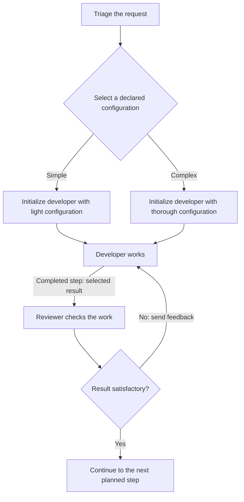
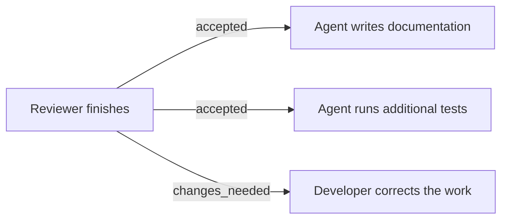
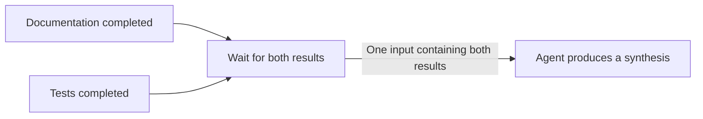

# Proposal 0020: message flow for persistent Agents

Status: **0.2 design directions accepted under
[Decision 0012](../docs/decisions/0012-blueprint-flow-directions.md); concrete
serialization and validation rules remain proposed.**
This extends the [Agent and Message model](0019-agent-prompt-and-resources.md).
It does not change the implemented 0017 candidate or the published specification.

## Problem and scope

Persistent Agents need a way to receive successive work, pass results and
cooperate. A graph limited to one acyclic sequence cannot describe a correction
loop, parallel reviews or a choice of configuration made by an earlier step.

Describe those choices in the system blueprint. Here, **blueprint** means the
authored system description, including its configuration and optional flow. It
is not an additional entity beside the system. A **step** is a unit of work in
that flow; completing it does not end an Agent's lifetime. Message content and
Agent continuity keep their definitions in 0019.

Flow remains optional. A single Agent exchanging Messages needs no graph. When
flow is declared, it describes what a consuming implementation should do. This
repository provides static readers, not an execution engine or a new transport.

## Accepted flow directions

### Completion and result transfer

When an Agent finishes a step, the flow proceeds to the planned successor or
successors. An intermediate Message is not sufficient evidence of completion.
The Agent remains available with its context for later steps.

Transferred content is configurable. By default, transfer all user-visible text
the Agent produces for the completed step, in response order, including
intermediate Messages and the final reply. For work started by one input
Message, this covers the response from that input through completion. It does
not include earlier conversation history or internal context.

Reasoning, Tool invocations and raw Tool results are excluded. A user-facing
explanation or quotation written by the Agent remains part of its response,
even when based on Tool results. Collecting intermediate text does not make it
a completion signal or forward it before the step completes.

A routing decision explicitly identified by the integration selects the
outgoing connections to follow without altering the default transferred text.
If that decision appears in the user-visible response, preserve it with the rest
of the text. If it is supplied only through a Tool invocation or result, it is
excluded under the rule above;
routing does not automatically insert it into the transferred text. This does
not prescribe a universal decision format or infer a decision from arbitrary
prose. The concrete routing mechanism remains candidate work.

For a step that uses an Agent-supplied routing decision, the Agent announces
that decision only when its work is finished. The decision closes the current
step; the Agent then waits for later Messages with its context. There is no
provisional routing decision or revision within that completed step, and no
"last decision wins" rule. Concrete integration rules must associate the
decision with step completion.

An explicit selection can instead transfer specified results, content or file
references, including non-text content. Selecting a file reference does not
grant access to its target. A previous step's reply cannot stand in for a
missing current result. No visible text alone is not an error when the required
outputs are present. The current c1 refinement below proposes selection syntax
and exact text assembly; these are not adopted rules.

By default, a direct transfer to another Agent delivers the result as
information in a Message. The recipient's instructions define what to do with
it. When the next task needs different instructions, explicit Message
preparation can add an authored request alongside the result. A simple handoff
needs no Prepare step when the recipient already has the required instructions.
The connection itself does not promote the source's reply into instructions or
replace the recipient's initial prompt or context. Concrete preparation syntax
remains proposed in [0021](0021-logic-block-contract-0.2.md#prepare).

Completion and a satisfactory result are different. A review that finishes with
"changes needed" can take the normal correction path. Interface constraints
still apply where declared; a malformed required result is not a valid success.

### Deterministic conditions and Agent decisions

When the authored rule can be evaluated from explicit data, the flow can apply
that condition directly. A test process's declared exit code can select a path
without asking an Agent for a second verdict. An Agent decision is appropriate
when the authored task calls for judgment. The blueprint makes that choice;
a consumer does not silently replace one with the other.

The exact predicates, data selection and validation behavior belong to the
proposed [block contract](0021-logic-block-contract-0.2.md). Data required by a
condition must be explicitly available to it. This does not add raw Tool
exchanges to the default Agent response transfer.

### Configuration selected before initialization

The blueprint may declare configuration alternatives and a rule that selects
one using an upstream result. Selection happens before initializing the affected
Agent. For example, a triage result can select a light or a thorough coding
configuration. Neither configuration nor Engine has an implicit default.

Once initialized, the Agent keeps that configuration and context. Returning to
it in a loop does not repeat initialization. This choice does not authorize
changing a running Agent's Engine or silently replacing its context. A different
Agent can have another configuration when the blueprint provides for it.
Changing the authored blueprint itself keeps the stop, edit and start rule.

### Recovery after failure

The blueprint may provide a recovery path. That path examines the actual state
and decides what to do next, including continuing work or asking for help. It
can use ordinary Agents and Messages; no separate recovery-agent type is needed.
Without a recovery path, the affected path stops with a diagnostic.

A missing or invalid required Agent output can take an explicit correction
loop: send the output diagnostic and an authored correction request back to the
same Agent. Its context and completed effects remain. The correction is new
work; a previously completed response is not reopened or silently replaced.
No extra Agent, text-only output requirement or blind replay of actions is needed.
Normal successors wait for a conforming result. This does not automatically
retry technical failures from Tools or Calls.

An interruption may occur after files or other external state have changed.
Failure does not imply that no work happened, that effects were undone, or that
replaying the request is safe. A recovery path therefore receives failure
information rather than a fabricated successful result. A normal negative
review follows its declared result branch, not this failure path.

### Parallel branches and loops

The blueprint may start independent branches in parallel. Several connections
from the same selected output of a step activate all their destinations as
parallel branches. No separate parallel-launch step is required. One routing
decision can therefore activate several destinations; connections from other
outputs of that step are not activated by that selection.

Their Messages still target the declared Agent instances. Parallel branches do
not grant concurrent access to an Agent beyond its message-handling mode below.

A loop follows its declared continuation and exit conditions. An iteration limit
is optional; by default there is no maximum iteration count. This does not
suppress the exit condition, failure handling or an explicit interruption.
Repeated work addressed to an existing Agent continues its context. No Goal
entity, mandatory budget or new Agent per iteration is needed.

### Messages received during work

Queueing is the default. A Message received while an Agent is busy waits for
later processing. Steering is an explicit alternative: the new Message guides
the ongoing work of the same Agent with its existing context.

A consuming integration must distinguish these modes. It cannot silently claim
steering while only queueing the Message. Unsupported requested behavior must be
reported. Queueing and steering introduce neither a context-reset option nor a
mandatory request/response transport. Their declaration location and delivery
acknowledgements still need candidate rules.

### Joining parallel results

A join is an explicit flow step. By default, it waits for all required branch
results and sends one input containing those results to the next step. Several
connections directly targeting an Agent instead deliver separate Messages,
handled according to that Agent's queueing or steering mode. Converging
connections alone do not imply a join.

The blueprint may instead configure a join to continue with the first
satisfactory result, using an explicit acceptance condition. The first response
alone does not satisfy that condition.

After such a result is accepted, request that the remaining unnecessary branch
work stop by default. The blueprint may explicitly let that work finish. This
stop concerns the work made unnecessary by this join, not the Agent's lifetime
or unrelated work. Its context remains available for later Messages.

A stop request is not confirmation that work has stopped. It does not undo file
edits or other effects. A consuming implementation must preserve that distinction;
it cannot assert a clean workspace or stopped activity from the request alone.
By default, retain the selected result and wait until the unnecessary work is
confirmed stopped or has finished before activating successors. The blueprint's
explicit let-finish alternative may continue without waiting; any remaining
workspace activity then remains possible. Missing or rejected stop acknowledgement
is not permission to proceed under the default. The integration must report it
and wait for actual completion or follow declared recovery. No timeout, rollback
or cancellation of unrelated work is implied.

## Small design scenarios

These illustrate the accepted directions. They are not executable artifacts or
proof that an Engine implements them. Diagram nodes describe work, not separate
Agent instances each time the node is visited.

### Fix and review until the result is accepted

One branch initializes the developer. Each correction returns to that same
Agent; the reviewer also keeps its context. Without an explicit result
selection, the developer sends all its user-visible response text for that step,
including progress Messages and the final reply, without reasoning or raw Tool
exchanges. The loop has no iteration cap unless the blueprint declares one.
A failed Engine call takes a declared recovery path, or stops the affected path
if none is declared. It does not produce an invented "changes needed" review.

### One decision starts two parallel steps

The two connections labeled `accepted` belong to the same output of the review
step. Selecting it starts both destination steps as parallel branches.
Selecting `changes_needed` starts only the correction step. The result-transfer
rules apply to each activated connection. This example does not introduce an
implicit join between the parallel results.

### Gather results before starting the next step

The join groups the required results before the synthesis step starts. Connecting
both producers directly to the synthesis Agent would deliver two separate
Messages instead. Grouping does not imply that every result is satisfactory;
any acceptance condition still applies. Result grouping and association with
the correct work still need concrete candidate rules.

### Two required checks or two alternative answers

| Declared flow | Behavior |
| --- | --- |
| Code review and test review are both required | Start both branches. Continue after both required results are available and the declared continuation condition is met. One completed review does not replace the other. |
| Two independent read-only analyses can answer the same question | Continue on the first result that satisfies the declared acceptance condition. Request stop of the other analysis unless the blueprint says to let it finish. |

The second case does not promise that the losing analysis has already stopped.
Required-result failure uses the recovery rule; it does not silently reduce the
set of required results.

### New input and interrupted work

| Situation | Expected meaning |
| --- | --- |
| "Also cover empty input" arrives while the developer works | With the default mode, process it later from the queue using the same Agent. |
| The same Message explicitly uses steering | The integration supplies it to ongoing work if steering is supported; it does not silently substitute queueing. |
| The Engine interrupts after editing a file | A declared recovery step inspects the file and failure information before deciding how to continue. Without recovery, stop the affected path with a diagnostic. |
| A later step returns to an Agent whose alternative work was stopped | Continue with retained context once the integration permits new work. Do not infer an empty context or undone edits. |

## Alternatives and consequences

A prompt-only convention leaves handoffs, failure handling and joins implicit to
consuming software. The optional flow makes them inspectable when authors need
that control. Mandatory flow for every Agent would burden the simple exchange.

Creating an Agent for each step would discard the accepted continuity model.
Hot configuration changes would introduce context-migration questions. Selecting
an authored configuration before initialization avoids both.

A mandatory loop cap conflicts with the chosen default. Implementations can have
operational limits, but must report a resulting interruption rather than claim
that the blueprint's success condition was met. Automatic retry and rollback are
not implied by recovery or branch cancellation.

## Security and compatibility

Flow does not grant Tool or workspace permissions. Result selection does not
turn resource content into instructions, authorize credential transfer or replace
approval controls. Human and software participation use the same Agent model;
a normal Message from either does not discharge an approval gate.

Concurrent branches may share editable resources. Their configured access still
applies, and stopping a branch does not establish exclusive access. This proposal
adds no universal locking, transaction or distributed scheduling protocol.

The acyclic 0017 graph, official 0.1.0 contract, readers and corpus keep their
meaning. A new edition must identify these different flow semantics. The
existing 42-case static comparison is not evidence for this model, context
continuity, steering, recovery or cancellation. No automatic migration is promised.

## Work before an implementable candidate

The flow directions above are settled at the design level. The current c1
refinements below propose concrete delivery, text assembly, configuration,
queueing, steering, correlation, Join and error rules. They need independent
review before adoption. The [block contract](0021-logic-block-contract-0.2.md)
retains separate composition, protected-action and support requirements that
these lifecycle refinements do not settle.

A candidate review must cover each small scenario above and adverse cases:
stale or missing results, unresolved configuration, unsupported steering,
required-branch failure, no acceptable alternative and an unconfirmed stop.
Static readers can test authored structure and compatibility declarations.
Continuity, delivery, completion and actual stop behavior require execution
evidence from consuming implementations. Durable restart recovery, arbitrary
Agent spawning and a runtime implementation are outside this proposal.

### Proposed c1 refinements after review

The [bounded c1 contract](../experimental/agent-flow-0.2/README.md) proposes
selecting configuration once from the first input, then retaining it without
reevaluating later Messages. This lets correction Messages carry the error
without repeating initialization data. A later selection-like value cannot
reconfigure the Agent.

It also proposes counting a Join visit when its anchor completes, before
starting the group's members. One admitted group consumes one visit regardless
of its outcome, acceptance mode or stop policy. A limit breach follows the
Join's error path without dispatching a new group or stopping previous groups.
A first-satisfactory Join stops evaluating acceptance once it retains a winner;
later member results only resolve its remaining-work wait.
A completion record may carry `choice` only for a step declaring a decision;
otherwise the recorded-output checker rejects it as `INVALID_RECORD`.

These clarify the experimental candidate. They do not change the accepted scope,
adopt the grammar, or establish execution support.

### Proposed portable delivery and lifecycle refinement

The current c1 revision defines proposed integration obligations, without
adopting a runtime or transport. Configuration selection reads the current flow
value before Agent delivery adaptation. Condition preserves that value and its
origin. A retained configuration is never selected again. Direct delivery uses
the origin contract, never the presence of payload keys. Entry and Prepare
Messages preserve authored roles; Agent text, Call data, Join members and
recovery errors become information. Prepare can select a source as a source,
preserving its URI and media type instead of wrapping or flattening it.

Each activation has an occurrence associated with its flow invocation, step,
Agent instance and, where relevant, Join group/member. Queue admission records
an order per Agent; one work item is active at a time. Repeated delivery of the
same occurrence is not a new activation. Completion resolves that occurrence
once and cannot release a continuation twice.

Explicit steering names an owning Agent step. The integration identifies the exact intended
occurrence in the same flow invocation before delivery; a step name alone must
not redirect a late request to a later loop visit. The owner must still be active. Acknowledged steering adds input to
that work and has no independent normal continuation, result or decision.
Only the owner completes and routes. Failure or a late request uses the steering
step's error path without failing the owner. Uncertain acknowledgement remains
pending until resolved; it is not assumed rejected or redelivered as queued work.
The bounded candidate rejects steering to or from Join members, so distinct
required results cannot collapse into one work item. Broader grouping of steered
work would need a separately reviewed rule.

Visible text concatenates text parts within each user-visible response Message
without a separator, then joins nonempty Message texts with one LF. Preserve
authored whitespace; do not trim, summarize or include reasoning, Tool
exchanges or earlier history. No visible text yields the empty string. Record
response order and attribution to the owning occurrence, including acknowledged
steering. Terminal completion closes collection; duplicates and late events
cannot alter the retained result. Optional recorded Message text parts let the
static completion checker verify assembly, not actual execution attribution.

The c1 contract gives failures a closed code vocabulary and the common recovery
input `error` with `code`, `message` and `details`. Error continuations belong to
the failed occurrence, keep diagnostic data informational and never manufacture
successful results, retries, cancellation or rollback. Output correction is a
new Message to the same persistent Agent. The concrete shapes and failure table
are proposed in the [candidate](../experimental/agent-flow-0.2/README.md).
