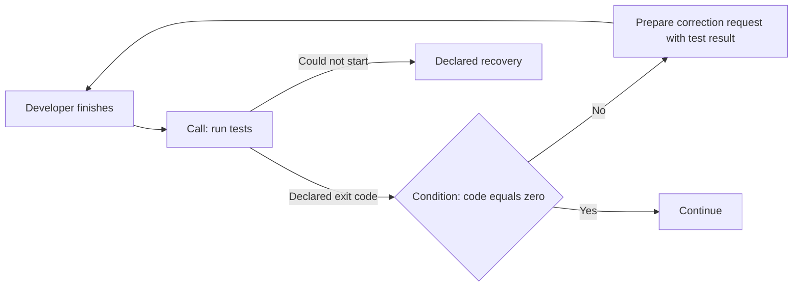
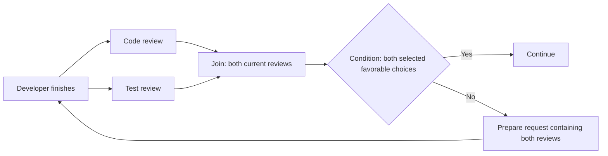
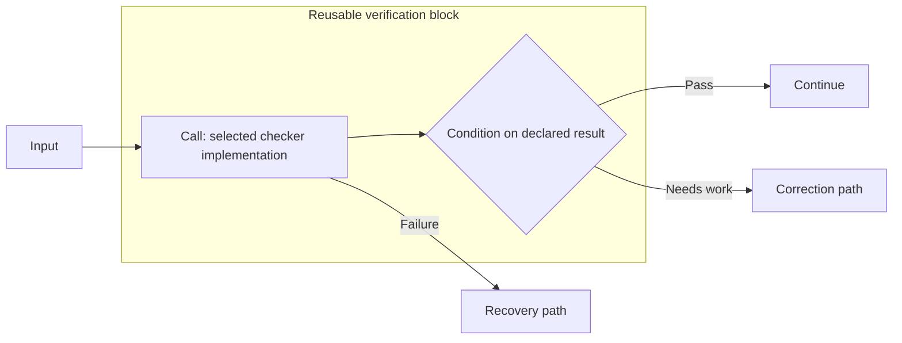

# Proposal 0021: a common contract for logic blocks

Status: **proposed semantic contract for 0.2 preparation; not adopted or
published. A bounded static experiment covers only part of it.** The maintainer requested preparation of standard
and custom blocks after reviewing the design. This text makes that work
reviewable; it does not treat every recommendation as an accepted requirement.
Accepted Agent and flow directions remain in [0019](0019-agent-prompt-and-resources.md)
and [0020](0020-blueprint-flow-0.2.md). This proposal is not a final JSON grammar. The
[candidate specification](../spec/0.2/README.md) defines concrete requirements;
its [tooling guide](../experimental/agent-flow-0.2/README.md) supplies examples,
a schema and static checks. Its marker and remaining exclusions do not adopt
or narrow the full 0.2 directions. See the [preparation index](../docs/0.2/README.md).

## Problem and scope

A graph needs deterministic choices, result grouping, Message preparation and
calls to functions that do not require Agent judgment. These operations should
compose through a small shared contract. Custom behavior needs the same visible
boundaries, including when it waits or fails.

The proposed minimum has four block families: **Condition**, **Join**,
**Prepare** and **Call**. Each is used only where needed. An Agent exchanging
Messages needs none of them. Approvals remain an optional control for explicitly
protected actions, not a mandatory part of every graph.

This repository describes blocks and their validation. Consuming software
executes them. This proposal adds no universal runtime, script language, provider
catalog, plugin installer or graphical editor contract.

## Terms and shared boundary

A **block** is a reusable behavior contract applied by a step. A **step** keeps
its meaning from 0020: a unit of work in the flow. An occurrence means one visit
to that step, including one visit in a loop; this is an association requirement,
not a mandated new public object. An Agent remains the persistent participant
defined in 0019. A block is not another kind of Agent.

A step's **routing output** names a continuation; its **result** is the content
made available to subsequent work. They can be carried together without being
the same thing. Selecting a routing output follows all its declared connections
under 0020. Names are local to the source step; identical labels elsewhere do
not connect unrelated work. A graph can explicitly bind the selected routing
output as control data for a Condition or Join. This is separate from adding it
to the visible text transferred to an Agent.

Each block contract describes the following information. These are semantic
obligations, not a list of mandatory JSON objects for every simple step.

| Part | Contract |
| --- | --- |
| Identity | A standard block has a versioned language definition. A reusable custom contract has an explicit identity and version. Parameters configure a use of that contract; they do not silently change its meaning. |
| Inputs | Identify received values or content, their roles and the constraints needed by the operation. Input data and authored parameters are distinct. An Agent receives a Message under 0019. |
| Activation | State what makes the step eligible to work: one delivered input, or a declared group for Join. Several incoming connections alone never imply waiting for a group. |
| Results | Describe the content produced and any required result constraints. Results become available when the relevant work completes, not because an intermediate progress Message exists. |
| Routing | Declare the possible routing outputs and how one is selected. An ordinary sequence needs no fabricated decision. Routing data is not inferred from arbitrary prose. |
| Completion and failure | Define when the current work has finished and which failures prevent a normal continuation. A completed negative result is different from a technical failure or an interruption. |
| Effects and requirements | Describe effects, access and support requirements when relevant, including the selected implementation for Call. Declarations do not grant permissions or prove support. |

An association with the current work is required at activation and completion.
A result from an earlier loop iteration cannot satisfy a later Join. A duplicate
or late delivery cannot silently reopen completed work. The [candidate lifecycle
rules](../spec/0.2/flow.md#queue-admission-work-identity-and-steering) define ordering
and acknowledgement obligations. Wire identifiers remain integration-specific;
no distributed transport or exactly-once infrastructure guarantee follows from
this boundary.

Standard blocks, compositions and external implementations share this boundary,
but need not share one internal algorithm. Join waits; Prepare can work as soon
as its input arrives. Agent steps use the same completion and routing rules
while retaining the Agent's separate lifecycle and configuration.

## Standard block families

### Condition

Condition evaluates an authored deterministic rule over explicitly available
data. It selects a routing output without asking an Agent to interpret the
result again. A Boolean or a comparison such as a test exit code equal to zero
is sufficient for a small case.

The candidate should start with a small set of comparisons and Boolean
combinations. Missing or wrongly typed required data is an error, not false or
a request for an undeclared Agent judgment. Multiple matching alternatives need
an explicit selection rule; arrival order is not that rule.

Condition does not run Tools, retrieve resources or extract a verdict from free
text. A declared integration can expose a specific Tool result as its input.
An Agent's final routing decision can instead select its own connections
directly, without a redundant Condition.

### Join

Join follows the accepted [grouping rules](0020-blueprint-flow-0.2.md#joining-parallel-results).
Its default mode waits for all required results and emits one input containing
them. Its explicit alternative selects the first satisfactory result under a
declared acceptance condition.

For each activation, identify the expected participants and the work to which
their results belong. Preserve result origins. Do not infer the expected set
from every drawn incoming connection: mutually exclusive alternatives might
never run together. A provably impossible required group is a validation error;
an unresolved dependency must remain visible as unresolved.

Grouping alone does not judge whether the results are satisfactory. A completed
negative review can be grouped and then tested by Condition. A failed required
branch uses recovery; it does not silently shrink the required group. Without
the required results or a qualifying alternative, there is no successful output.

For the first-satisfactory mode, use 0020's policy for requesting that unnecessary
work stop and waiting for confirmed stop or completion before continuing, unless
the author explicitly chooses to let it finish. A request does not establish
that it stopped. The bounded c1 candidate proposes concrete tie and exhaustion
rules; integration acknowledgements still require implementation evidence.

### Prepare

Prepare constructs content deterministically: select a result, add authored
instructions, assemble items or include a resource reference. An unchanged
transfer remains a direct connection using 0020's default visible response text.

Preserve instruction/information roles, media and declared ordering. Adding an
authored instruction does not make incoming resource text authoritative. Prepare
does not replace an Agent's initial prompt, configuration or context. It does
not perform an implicit model summary, fetch a referenced document or claim
that a media conversion preserves the original. Such work belongs to an Agent
or an explicitly configured Call.

Result selectors and preparation must have one semantic definition. The future
grammar must settle their placement without defining competing transformations
on a connection and a Prepare step. Unavailable selected content is reported;
an old reply is not substituted.

### Call

Call describes work performed by a function, Tool or service with a selected
implementation. This extends the proposed flow beyond Agent-only calls; it is
not behavior already implemented by the 0017 readers.

Reuse the existing separation of Tool contract and implementation rather than
inventing a second provider catalog. Describe inputs, results, parameters,
completion, failures, effects and required capabilities. A contract identity or
an opaque setting does not prove that the implementation exists or supports it.
The [candidate binding syntax](../spec/0.2/content.md#agents-configuration-and-reusable-behavior)
remains proposed.

A returned nonzero test exit code can be a normal Call result that a Condition
examines. Failure to start the test process is a technical failure. The selected
contract determines this distinction; neither value is silently turned into a
successful test outcome. Repeating a Call is never presumed safe or free of
effects. Recovery follows the declared flow and actual state.

Call provides explicit access to a result. It does not add internal Tool traces
to the default text transferred between Agents. When an Agent itself runs a
Tool, exposing a selected result to a Condition requires a declared integration
mapping instead of guessing it from the Agent's report.

## Agent decisions and protected actions

An Agent supplies a routing decision only when it has finished the current work,
as required by 0020. The blueprint declares the available choices. Its integration
identifies the source and maps the final choice to the corresponding routing
output. A Tool exchange, structured content, a text convention or a human
interface can supply it; none is a universal required mechanism.

That mapping must unambiguously associate the decision with the completed work.
A missing, unknown or ambiguous required choice cannot take a successful path.
A text convention must distinguish a real selection from quoted report content.
There is no provisional choice, implicit first/last winner or second decision
that reopens completed work. The candidate defines the required association and
choice checks; each external decision integration specifies its mechanism.

The mapping does not rewrite the transferred visible text. A decision present
in that text stays there. A decision present only in a Tool exchange is not
automatically inserted. Required result constraints still apply; announcing a
choice does not fabricate a missing result or successful completion.

An ordinary Agent opinion, including a human response, is not an authorization
for a protected action. If the blueprint requires an approval, it applies to
the actual call and its scope, including through a custom Call or composition.
The consuming integration checks authority and decision matching before admitting
that action. Effects alone do not impose a universal human-approval requirement.
The existing approval semantics are a source for the next contract, not proof
that their old serialization already binds the new blocks.

## Building reusable and custom blocks

### A composition of existing steps

A composition presents declared inputs and routing outputs for a local graph of
existing steps. An editor may display it as one block, while a reader can inspect
the expanded content. Composition does not change the meaning of its steps.

Keep Agent references and internal step names explicit when expanding the graph.
Reusing the composition must not silently create new Agents, reset their context
or share previously distinct instances. Repeated work addressed to the same
declared Agent continues its existing instance. The first candidate should use
local, non-recursive compositions; package distribution and arbitrary dynamic
Agent creation are outside this proposed minimum.

### An external implementation

A custom function uses Call with its declared contract and selected
implementation. Keep the contract identity, parameters, inputs, results, routing,
failures, effects and requirements visible. Its implementation can be local or
external; AgSDL does not impose a language or a universal hosting service.

A reader can inspect connections while being unable to interpret a custom
behavior. Report that limit. A consumer missing a required implementation cannot
silently skip it or claim that the affected path is executable. Distinguish
structural validity, understood semantics, declared support and actual execution
evidence. Static validation fetches or executes no extension code.

A custom behavior that changes graph activation, concurrency or Agent lifetime
requires an explicit semantic extension beyond a Call. It cannot pass as a
standard block merely by hiding those changes in parameters. Its support and
validation contract need separate definition.

## Small contract scenarios

These are semantic review examples, not serialized fixtures or execution proof.
For inputs, result bindings, repeated visits and failure paths, read the
[worked scenarios](../docs/0.2/worked-scenarios.md).

### Deterministic check and correction

The developer keeps its context through the loop. The Call supplies test data;
the Condition does not use a model's assurance that the tests passed. Prepare
provides the next instruction and supporting result without replacing the
developer's initial setup.

### Two required reviews

The final choices and results of both reviews feed this Join; no review
independently starts a correction while its sibling's old result remains pending.
The Condition names which local choices are favorable. There is no universal
meaning attached to a label such as `accepted`. A technical failure follows
recovery rather than standing in for an unfavorable completed review.

### Reuse and external behavior

The composition remains inspectable. Replacing the checker implementation is a
configuration choice made before the system starts; it is not hot replacement.
Without a compatible implementation, the Call remains unresolved or unsupported
according to the evidence available. No new Agent is implied by this composition.

## Alternatives and consequences

Making every operation an Agent would impose a participant lifecycle and context
on plain functions. Making every behavior an opaque custom block would hide
common semantics from readers. Separate block types for every selector, retry,
loop or parallel launch would duplicate combinations already expressible by
Prepare and the flow connections.

This proposal instead standardizes a small boundary and a few operations. Calls
can be integration-specific without making basic branching or grouping opaque.
Approval remains a control where required. Native timers, generic event listeners,
collection iteration and custom scheduling are not added to the minimum.

## Compatibility and review before implementation

The official specification and frozen 0017 grammar remain unchanged. Their
comparisons cannot validate this contract. Current extension declarations do
not supply an interpreter for these blocks. The [candidate specification](../spec/0.2/README.md)
now supplies the proposed grammar and scoped validation rules under its own
marker. Reader evidence applies only to those rules and checked inputs.

The [bounded c1 contract](../spec/0.2/README.md) proposes
predicate syntax, current-input selectors, versioned bindings, Join ties and
exhaustion, and output-correction diagnostics. Those choices still need final
adoption. The current c1 refinement proposes work correlation, queue/steering
boundaries, text assembly, bounded composition bindings and approval admission.
Their static and supplied-record checks still need independent semantic review. The
[preparation index](../docs/0.2/README.md#before-a-02-release) tracks completion.

At minimum, the future conformance material should distinguish:

| Scenario | Required distinction to exercise |
| --- | --- |
| Final choice has two outgoing connections | Both selected destinations activate; another choice's connections do not. |
| Two direct inputs versus an explicit Join | Two Messages versus one grouped input. |
| A later loop iteration and a delayed earlier result | Only results associated with current work can satisfy its Join; Agent context continues. |
| Valid, missing and wrongly typed Condition data | A valid selection versus an explicit error; no silent model fallback. |
| Nonzero test exit code versus process launch failure | Completed Call result versus technical failure. |
| Prepare with instructions, resource text and media | Roles and content remain distinct; no implicit fetch, summary or context reset. |
| Required branch fails or no alternative qualifies | Recovery or an explicit terminal diagnostic; no fabricated satisfactory result. |
| Quoted text resembles a routing marker | Mapping distinguishes content from an actual final selection. |
| Custom behavior unknown or implementation absent | The limitation remains visible; no code execution or inferred support. |
| Protected call receives an ordinary favorable opinion | Opinion does not bypass its approval control. |
| Composition is reused with an existing Agent | Reuse does not create or reset the Agent implicitly. |

Static readers can check declarations and their limits. Delivery, execution,
effects, permission enforcement, context continuity and actual stopping require
separate evidence from consuming implementations.

## Bounded implementation work

The [c1 contract](../spec/0.2/README.md) makes the basic
walkthroughs testable with declarations and a static reader. It proposes
input-preserving Conditions, selectors restricted to current input, reusable
content/skill/configuration bindings and direct fork-and-join with all-required or first-satisfactory selection.
These concrete rules remain proposed. Review the bounded steering form below,
the retained protected-action control and the portable input/completion/error
boundary. Local composition is the proposed realization of reusable graphs,
subject to review and adoption with the block contract. External contracts may
supply integration-specific details without redefining that portable boundary.
Configuration selection has a proposed c1 shape; claims about actual lifecycle
support require evidence from consuming implementations. Such evidence is not a
universal prerequisite to publishing the language draft. The experiment neither
silently drops accepted directions nor supplies execution evidence.

## Proposed c1 data and recovery boundary

The [c1 delivery contract](../spec/0.2/flow.md#portable-delivery)
now carries origin alongside the current value as integration metadata. Condition
preserves both; Call does not promote a returned Message-shaped object into
instructions. Prepare is the explicit construction boundary. Its `select`
resource inserts an inline value; its `source` resource copies a selected content
source, preserving URI, representation and information role. Missing operands
and a selected value that is not a source fail before any prepared Message is
delivered. There is no fetch or implicit media conversion.

The c1 lifecycle rules correlate occurrence completion, queue admission,
steering acknowledgement and Join membership. Its closed failure vocabulary
and common error input apply across blocks. These rules remain proposed, and
static record checks do not demonstrate delivery or scheduler behavior.

## Proposed bounded modular contract

The candidate defines [local expansion and protected admission](../spec/0.2/flow.md#local-composition-and-protected-admission).
Its initial composition form is non-nested and serial or conditional internally;
it preserves explicitly bound Agent identities. Approval gates protect actual
Agent work or Calls, including after expansion. Capture, deadlines and scoped
admission are integration obligations with a supplied-record consistency check,
not authentication or runtime enforcement. These concrete rules remain proposed.
